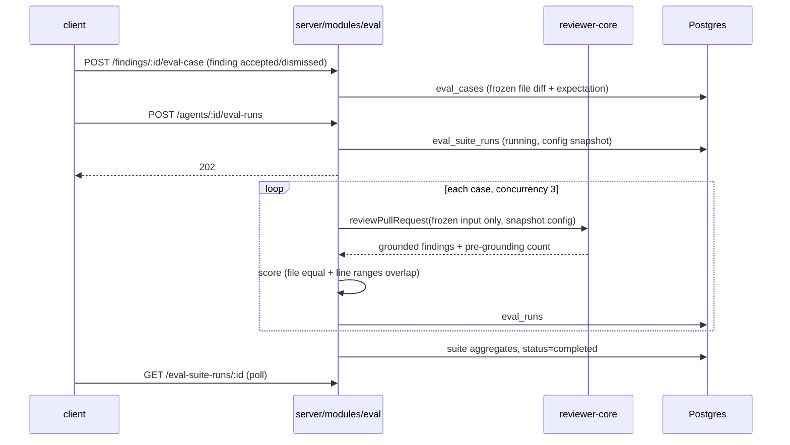

# Eval Pipeline — regression tests for review agents

Spec: [specs/eval-pipeline.md](../specs/eval-pipeline.md) (SPEC-04) · Plan: [specs/PLAN-04-eval-pipeline.md](../specs/PLAN-04-eval-pipeline.md)

Change an agent's system prompt, model or linked skills → run its test set → read recall / precision /
citation accuracy → decide whether the change broke or improved the agent. Cases live in Postgres next to
the findings they come from; scoring is plain code (no judge model).

## How it works

- **Cases.** "Turn into eval case" on a `FindingCard` (PR Findings tab and Agent runs tab). Accepted finding →
  `must_find`; dismissed → `must_not_flag`. Undecided findings keep the button disabled. The case freezes the
  finding's file diff and PR title/description, so every run of every agent version sees identical input.
  Cases can also be created and edited by hand in the Evals tab (expected output is a JSON array; `[]` with
  `must_not_flag` means "this input must produce no findings").
- **Runs.** The runner builds its input from the case only (`buildFrozenReviewInput`) — no repo-intel, callers,
  project context, memory or intent — and calls `reviewPullRequest` directly. It never uses the production
  run executor. Skill bodies are resolved once at suite start. One running suite per agent (DB partial unique
  index → 409).
- **Scoring** (`server/src/modules/eval/scoring.ts`, pure and deterministic): a finding matches an expectation
  when the file is equal and the inclusive line ranges overlap.
  - **recall** = matched `must_find` expectations / all `must_find` expectations.
  - **precision** = 1 − noise / grounded findings. Noise = a finding that matches a `must_not_flag`
    expectation, or any finding on a case whose expectation is `[]`. Findings matching nothing in a `must_find`
    case are neutral.
  - **citation_accuracy** = grounded findings / findings the model emitted before the grounding gate.
  - A case that errors (provider error, schema failure, timeout) is excluded from all metric denominators.
  - Metrics are `null` (shown "—") when their denominator is empty.
- **Where to look.** Agents → *Evals* tab (cases, run all, per-case run); **Eval Dashboard** in the sidebar
  (all agents; per-agent page with trend, runs table, **Compare** two runs: metric deltas + prompt diff,
  **Promote vN**). Alert banner when a metric drops ≥ 2 pts versus the previous completed run.

API surface (all workspace-scoped): `POST /findings/:id/eval-case`, `GET|POST /agents/:id/eval-cases`,
`PATCH|DELETE /eval-cases/:id`, `POST /eval-cases/:id/run`, `POST|GET /agents/:id/eval-runs`,
`GET /eval-suite-runs/:id`, `GET /eval-suite-runs/compare?a&b`, `GET /eval/dashboard`,
`GET /agents/:id/eval-dashboard`. Tables: `eval_cases`, `eval_runs` (one per case run),
`eval_suite_runs` (one per "Run all", carries the agent version + config snapshot). Migration `0017` —
remember `cd server && pnpm db:migrate`.

## Sensitivity experiment

Goal: show the harness reacts to prompt changes (the same test you ran by hand on `SKILL.md`).

**Setup.** A throwaway agent (`openai/gpt-4.1-mini` via OpenRouter, repo-intel off) and six cases built from
hand-written diffs:

| Case | Expectation | What it checks |
|---|---|---|
| `stripe-key-leak` | must_find | hardcoded `sk_live_…` key |
| `sql-injection-users` | must_find | SQL built by string interpolation |
| `ssrf-webhook` | must_find | `fetch()` of an attacker-supplied URL |
| `clean-refactor-no-flags` | must_not_flag `[]` | harmless helper code — any finding is noise |
| `fake-test-key-fixture` | must_not_flag (line 6) | fake `sk_test_…` key in a test file |
| `unused-import-only` | must_not_flag `[]` | one unused import, nothing else |

Each prompt version ran **3 times** on the full set (LLM output varies run to run).

| Version | Prompt | recall | precision (min–max, mean) | citation | cases passed (3 runs) | cost / run |
|---|---|---|---|---|---|---|
| v1 | generic: "review the diff and report any issues" | 1.00 | 0.80–1.00, 0.87 | 1.00 | 6, 5, 5 | $0.0071 |
| v2 | strict security-only; ignore style, unused imports, fake test keys; empty list when clean | 1.00 | 1.00 | 1.00 | 6, 6, 6 | $0.0063 |
| v3 | v2 + "also flag unused imports" (see caveat) | 1.00 | 1.00 | 1.00 | 6, 6, 6 | $0.0065 |
| v4 | **degraded**: "report everything incl. style, tests, improvements; always return ≥ 3 findings" | 1.00 | **0.67–0.91, 0.79** | 1.00 | **3, 4, 5** | **$0.0124** |
| v5 | v2 with "unused imports" removed from the don't-list and re-added as a suggestion | 1.00 | 1.00 | 1.00 | 6, 6, 6 | $0.0060 |

**Reading it.**
- **Tightening helps:** generic → strict removes the unused-import and fake-key noise (precision 0.87 → 1.00,
  5–6/6 → 6/6) at no recall cost.
- **Degrading hurts precision, not recall:** the degraded prompt still finds all three real bugs (recall stays
  1.00) but emits style/test-coverage findings on clean code and on the fake test key — precision falls to
  0.67–0.91, only 3–5 of 6 cases pass, and cost doubles. Recall alone would have hidden this regression, which
  is why the `must_not_flag` cases matter.
- **Citation accuracy didn't move** — the model never invented a location here, so the gate had nothing to
  drop. That metric needs a case set that provokes hallucinated lines.

**Caveats found along the way.**
- *Variance is real.* Version v1 passed 6/6 once and 5/6 twice with an identical prompt; a single run can
  mislead, so compare ranges over repeats rather than one number.
- *Errored cases vanish from the metrics.* A first attempt on `deepseek/deepseek-v4-flash` had 2–4 of 6 cases
  error (schema-validation failures, 120 s timeouts), and the degraded prompt scored "precision 1.0" from the
  two cases that survived. Always check the error count before trusting a run; the experiment was redone on
  `gpt-4.1-mini` with zero errors.
- *A prompt with contradictory instructions silently no-ops.* The first "plus unused imports" variant kept
  "Do NOT report … unused imports" earlier in the text and changed nothing (v3). Even the corrected v5 still
  produced no unused-import findings: the strong "exploitable security vulnerabilities" framing outweighed
  the extra line for this model. The prompt-diff view in Compare makes this kind of non-change visible.

## Known limitations

- `eval_cases.owner_id` has no foreign key (it is shared with skill-owned cases), so deleting an agent leaves
  its cases behind as hidden rows (its suite and case runs do cascade). Delete cases first, as the experiment
  cleanup did.
- A case created from a finding copies the PR's *current* diff, which can differ from the diff the review
  originally ran on if the PR changed since. The case's agent version is the agent's current version.
- A `must_not_flag` case also penalises a later, correct finding on the same lines; edit the expected range if
  that happens.
- Suites run in-process (fire-and-forget); a server restart mid-run leaves the suite `running` until the 30-minute
  stale sweep marks it failed. Queued cases are not resumed.
- Rate limits on the two LLM-spending routes are configured but disabled under test.
- Compare/trend need at least two completed runs; the UI trend chart skips runs with a null metric.
