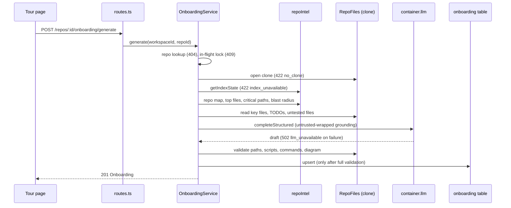

# Onboarding Tour

Generates a structured, grounded "getting started" tour for an imported repo
(architecture, critical paths, run-locally commands, reading path, first
tasks) and renders it at `/repos/:repoId/tour`. Spans `server/` and `client/`.
Spec/plan: `specs/SPEC-02-onboarding-tour.md`, `specs/PLAN-02-onboarding-tour.md`.

One tour is stored per repo (the `onboarding` table, `repo_id` PK). Generation
is a single synchronous LLM call over deterministic grounding; every path,
script and command in the result is re-verified against the on-disk clone
before anything is persisted. Nothing generated is ever executed.

## Flow

## Endpoints

Code: `server/src/modules/onboarding/{routes,service,repository,helpers,constants,types}.ts`,
registered in `modules/index.ts`. Routes are workspace-scoped through
`RepoRepository.getById(workspaceId, repoId)`; an unknown or foreign repo is 404.

| Method + path | Returns |
|---|---|
| `GET /repos/:id/onboarding` | the stored `Onboarding`, or `null` (200) when none exists |
| `POST /repos/:id/onboarding/generate` | `201` with the new `Onboarding`; regenerating replaces the single row |

Failures carry a machine-readable `error.details.reason`:

| Status | `reason` | When |
|---|---|---|
| 409 | `generation_in_progress` | a generation for the same repo is already running |
| 422 | `no_clone` | the repo has no (readable) clone on disk |
| 422 | `index_unavailable` | `REPO_INTEL_ENABLED` is off, or index status is not `full`, or it is degraded |
| 502 | `llm_unavailable` | LLM call failed after retries, returned an invalid shape, or the assembled tour failed the contract check |

`ConflictError` (409, code `conflict`) was added to `server/src/platform/errors.ts`.
A failed generation never touches the previously stored tour.

## Persisted contract

`Onboarding` in both vendored `contracts/knowledge.ts` copies (edit both by
hand; server is canonical):

- `version` (literal `1`), `index_files` (IndexState.filesIndexed snapshot),
  `generated_at` (the row column, set by the DB clock, merged in on read).
- `sections.architecture`: `prose` (markdown), `nodes` (max 12: `id`, `label`,
  `kind` in `client|server|middleware|datastore|external|api|other`, optional
  `file`), `edges` (max 48: `from`, `to`, optional `label`).
- `sections.critical_paths[]`: `path`, `description`, optional `callers`.
- `sections.run_locally[]`: `command` (single line, max 300), optional `comment`.
- `sections.reading_path[]`: `path`, `reason`.
- `sections.first_tasks[]` (max 5): `title`, `description`, `files` (1 to 8).

On read, the repository runs `Onboarding.safeParse`; a corrupt row or unknown
`version` is logged as a warning and treated as "no tour" (`null`).

## Generation details

1. Grounding (`gatherGrounding`): repo map, top files by rank, critical-path
   chains, plus key clone files (`KEY_FILES`: README, manifests, compose,
   Makefile, CONTRIBUTING...), TODO/FIXME hits and top files lacking a sibling
   test. Blocks are packed by priority into a 24k-token budget
   (`GROUNDING_TOKEN_BUDGET`); the block crossing the budget is cut and later
   blocks are dropped.
2. Prompt: `server/src/prompts/onboarding.system.md` rendered with
   `language = English`; model from `resolveFeatureModel(..., 'onboarding')`.
3. LLM: `completeStructured`, 120 s timeout, 2 retries, 6000 output tokens.
4. Validation and sanitising (below), then a full `Onboarding.safeParse`, then upsert.

## Validation rules

All model output is untrusted and re-checked in `helpers.ts`:

- **Paths** (`server/src/adapters/git/repo-path.ts`): repo-relative only, no
  `..`, no NUL, no absolute or drive paths, max 500 chars. `createRepoFiles`
  resolves the `realpath` of each path and requires it to be inside the clone's
  realpath and a regular file (symlink escapes rejected); reads over the size
  cap are skipped. Unlike the markdown guard, any file type is allowed.
- **Prose**: inline-code tokens that look like paths but do not exist lose their
  code formatting; markdown links keep text and drop the URL; images are removed.
- **Commands**: single line, no control characters, 1 to 300 chars. Shell
  metacharacters are rejected (backtick, `$(`, `|`, `&`, `<`, `>`); `&&`, `||`
  and `;` remain allowed as separators. Steps failing are dropped, not repaired.
  Every `npm|pnpm|yarn [run] <script>` (bare `pnpm dev` counts as a script,
  builtins like `install` do not) must exist in the nearest `package.json`
  walking up from the effective directory (`cd`, `--prefix`, `-C`, `--dir`,
  `--cwd` are followed; `--filter`/workspace forms are unresolvable and dropped).
- **Diagram**: max 12 nodes and 48 edges, unique ids, labels collapsed and
  clipped; nodes whose `file` is unsafe or missing are dropped; edges with
  unknown endpoints or duplicates are dropped.
- **Critical paths**: rows are seeded from repo-intel; the model contributes
  only the description. `callers` is the count of distinct caller files from
  `getBlastRadius` (omitted when degraded), never taken from the model.
- **Reading path**: existing, deduplicated files, max 10.
- **First tasks**: only existing files kept (max 8 each), tasks left with no
  files dropped, capped at 5. Survivors persist even when fewer than 3, so
  "3 to 5" is a target enforced by the prompt, not a hard lower bound.

## Untrusted-input handling

Every grounding block from the repo (critical files, top files, key files,
repo map, TODO hits, untested list) is wrapped with `wrapUntrusted`; the system
prompt keeps the `<untrusted>` data-not-instructions clause. Paths used in
headings pass through `sanitizeHeadingPath` (`[A-Za-z0-9._\-/ @+()]`, others
become `_`). On the client, prose is rendered with `react-markdown` (raw HTML
off, links rendered as plain text, images not rendered); no
`dangerouslySetInnerHTML`. Only `command` is ever copied to the clipboard.

## Client

- Hooks: `client/src/lib/hooks/onboarding.ts` (`useOnboarding`,
  `useGenerateOnboarding`, `onboardingErrorReason` reading `ApiError.details.reason`).
  A successful generate writes the result into the query cache; a failure leaves
  the cached tour intact.
- Page: `client/src/app/repos/[repoId]/tour/page.tsx` (thin) renders
  `_components/TourView/`: loading skeleton, first-visit empty state with a
  Generate button (no auto-generate; Regenerate appears only once a tour exists),
  error banner with per-reason messages, "On this page" nav with hash sync and
  deep links, five collapsible `SectionCard`s (`aria-expanded`).
- Sections: Architecture (markdown prose + deterministic SVG layered graph, colour
  by node kind, plus an ordered edge list for accessibility), Critical paths
  (caller counts, "Open" link to `github.com/<full_name>/blob/<default_branch>/<path>`,
  `noopener noreferrer`), Run locally (per-step copy button, aria-live feedback),
  Reading path, First tasks.
- Header: subtitle with indexed-file count and relative time, Regenerate, and
  Share link (clipboard, with a selectable read-only field as fallback).
- Nav: `Onboarding Tour` item (icon `Workflow`) in `client/src/vendor/ui/nav.ts`;
  `activeKeyFor` in `components/app-shell/helpers.ts` maps `/repos/:repoId/tour`.
  Strings: `client/messages/en/onboarding.json`.

## Config

- `REPO_INTEL_ENABLED` must be `true` (default). When off, generation fails with
  422 `index_unavailable`; the repo must also be fully indexed and not degraded.
- LLM keys and the `onboarding` feature model are resolved through settings as for
  other features; a missing/failed provider surfaces as 502 `llm_unavailable`.
- No migration: the `onboarding` table already existed.

## Known limitations

- The in-flight lock is a process-local in-memory `Set`; it does not protect
  across multiple server processes.
- Generation is synchronous within the HTTP request (120 s timeout, 2 retries);
  there is no job/progress mechanism.
- `OnboardingService` imports sibling modules directly (`RepoRepository`,
  `resolveFeatureModel`) and takes the whole `Container` rather than narrow
  ports. Accepted; it copies the conventions module's convention.
- Tour language is fixed to English (`ONBOARDING_LANGUAGE`); no per-workspace setting.
- Grounding is capped at 24k tokens; large repos are truncated by priority.
- No e2e flow covers the tour yet (server unit/integration and client component
  tests only).
- No `g`-then-key keyboard shortcut for the tour.
- Out of scope per plan: dangerous-command filtering beyond the rules above,
  scroll-spy, stale-tour banner, Regenerate confirmation.
