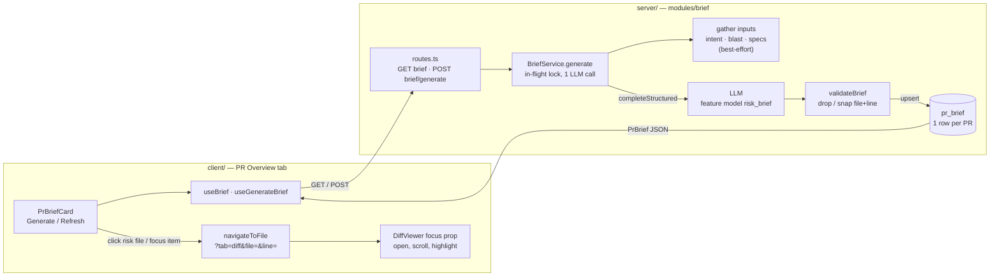

# PR Brief (Why + Risk)

Cross-package concern (`server/` + `client/`, vendored contract in both):
an on-demand, LLM-written brief for a PR — a summary, ranked **Risk areas**,
and an ordered **Review focus** list of `file:line` places to read first.
It is shown on the PR **Overview** tab (`PrBriefCard`). Nothing is generated
automatically; a user clicks Generate / Refresh.

Origin: `specs/SPEC-03-pr-brief.md` / `specs/PLAN-03-pr-brief.md` (in-flight
design docs; this page describes what shipped).

## Flow

## Endpoints

Both in `server/src/modules/brief/routes.ts` (registered in
`server/src/modules/index.ts`), both workspace-scoped: the PR is resolved via
`reviewRepo.getPull(workspaceId, prId)` first (404 if not in the workspace),
because `pr_brief` itself has no `workspace_id`.

| Endpoint | Behavior |
|---|---|
| `GET /pulls/:id/brief` | 200 with the stored `PrBrief`, or a `null` body when none exists. A stored row that fails `PrBrief.safeParse` (corrupt / old shape) is treated as `null` and logged. Never generates. |
| `POST /pulls/:id/brief/generate` | Synchronous generate + upsert; returns the brief with **201**. Rate-limited to 10/min per route. Regenerating replaces the single row. |

Contract: `PrBrief` / `ReviewFocusItem` / `BriefErrorReason` in
`server/src/vendor/shared/contracts/brief.ts` and the client copy (vendored,
edit both by hand). `PrBrief` = `summary`, `risks[]` (`title`, `explanation`,
`severity` high|medium|low, `file_refs[]`, optional `kind`), `review_focus[]`
(`file`, `line`, `reason`), `missing[]`, `generated_at`, `generated_for_sha`,
`model`, `usage`.

## Error reasons

Failures carry `error.details.reason` (client: `briefErrorReason()` in
`client/src/lib/hooks/brief.ts`, mapped to i18n keys `brief.error.<reason>`).

| Reason | HTTP class | When |
|---|---|---|
| `generation_in_progress` | 409 | A generation for the same PR is already running (process-local `Set` lock, released in `finally`). |
| `no_files` | 422 (validation) | The PR has no changed files. |
| `llm_unavailable` | external-service error | Feature model / provider / prompt template could not be resolved. |
| `generation_failed` | external-service error | LLM call failed or returned invalid JSON, nothing usable survived validation, or the final `PrBrief.safeParse` failed. |

On any failure the previously stored brief is untouched, and the client keeps
showing it with an `aria-live` error message. The lock is per server process,
not distributed.

## Inputs (all best-effort)

Gathered in parallel, each in its own try/catch; an unavailable input is
listed in `missing[]` (`intent` | `blast` | `specs`) and the prompt says so
explicitly ("Do not guess their content") rather than letting the model infer.

- **Intent** — the *persisted* Intent record only; never triggers an Intent
  LLM call.
- **Blast radius** — repo-intel summary plus up to 20 distinct calling files.
  Skipped when `REPO_INTEL_ENABLED=false`, the result is degraded, or empty.
- **Specs** — attached Project Context specs of all enabled agents in the
  workspace (see [project-context.md](project-context.md)), capped at 24,000
  chars.
- **Changed files** — path, +/-, Smart Diff role (`classifyFile`, see
  [smart-diff.md](smart-diff.md)) and right-side hunk line ranges. **No code**
  is sent. Capped at 120 files (sorted role, then churn) with an
  "N more files omitted" line; at most 8 hunk ranges per file.
- PR title and description (description capped at 4,000 chars).

Exactly one `llm.completeStructured` call (helper-level JSON-repair retries
only: `maxRetries` 2, 90 s timeout, 3,000 output tokens), using the model
resolved by `resolveFeatureModel(..., 'risk_brief')` and the
`risk-brief.system.md` prompt. Prose language is fixed to English.

## Untrusted-input handling

Every PR-derived block (title, description, intent, blast radius, specs,
changed-file list) is wrapped with `wrapUntrusted(...)` before it enters the
prompt, and file paths go through `sanitizePathForHeading` so a crafted
filename cannot forge a delimiter. Model output is itself treated as
untrusted and re-validated (below) before persisting. Logs record only
names, sizes, model, tokens and cost — never PR text, specs or model prose.
No keyword scanning of text; same stance as the reviewer's injection guard
(see `server/README.md` "Review context").

## Validation rules (`validateBrief`, pure, in `helpers.ts`)

Runs before anything is persisted, so hallucinated files/lines never reach
the DB.

- **Path matching** (`normalizePath`): exact match on a changed path; else
  after trimming and dropping a leading `./` or `/`, a *unique*
  case-insensitive match (also against the prompt-sanitized spelling).
  Ambiguous or unknown paths resolve to nothing.
- **Risks**: max 8. Non-matching `file_refs` are dropped and duplicates
  removed; a risk left with no refs is **kept**. Empty titles dropped.
- **Review focus**: max 5. An item whose file is unknown, or has no
  right-side hunk (deleted / binary / no patch), is dropped. Its `line` is
  **snapped**: a line inside any hunk range `[newStart, newStart+max(newLines,1)-1]`
  stays; otherwise it moves to the *start of the nearest hunk* (earlier hunk
  wins ties). Duplicate `file:line` pairs are deduped.
- **Length caps**: summary 1,200; title 200; explanation 800; reason 300;
  kind 40 chars.
- **Empty result**: if summary, risks and focus are all empty, generation
  fails with `generation_failed` and nothing is stored.

## Staleness

`generated_for_sha` stores the PR head SHA at generation time. The card
compares it with the PR's current `headSha` (`isStaleBrief`) and shows a
"generated for an earlier commit" notice; it does not auto-regenerate.

## Usage / cost

`usage` = `{ prompt_tokens, completion_tokens, cost_usd | null }`, or `null`
when the provider reported nothing. The card shows a line only when there is
usage: tokens + cost if `cost_usd > 0`, tokens only otherwise.

## Deep link: `?tab=diff&file=&line=`

Clicking a risk file ref or a Review-focus item calls `navigateToFile` in
`usePrDetailPage`, which `router.replace`s the PR URL using
`buildFileFocusQuery` (`PrDetailView/helpers.ts`): sets `tab=diff`, `file`,
and `line` (only when a positive integer; otherwise `line` is removed),
preserving other params such as `trace`. On load, `parseDiffFocus` reads
`?file=&line=` — no `file` means no focus, and a garbage `line` degrades to
file-only focus.

The resulting `DiffFocus { file, line | null }` is passed to the generic
`DiffViewer` / `SmartDiffView` `focus` prop (`client/src/components/diff-viewer/focus.ts`).
`FileCard` for that path expands (even if it would be collapsed by default,
including after a URL change on an already-mounted card) and scrolls into
view; `CodeLine` highlights the matching **right-side** line
(`data-testid="diff-focused-line"`, `aria-current="location"`). If the line is
not part of the rendered patch, only the file is focused. The viewer knows
nothing about the brief; the focus contract is reusable by any caller.

## Where things live

| Concern | Path |
|---|---|
| Routes / service / pure validation / constants | `server/src/modules/brief/{routes,service,helpers,constants}.ts` |
| Persistence (`pr_brief`, upsert) | `server/src/modules/brief/repository.ts` |
| Hooks | `client/src/lib/hooks/brief.ts` (query key `["pr-brief", prId]`) |
| UI | `client/src/app/repos/[repoId]/pulls/[number]/_components/OverviewTab/PrBriefCard.tsx` (+ `RiskList`, `ReviewFocusList`) |
| Diff focus | `client/src/components/diff-viewer/focus.ts` |
