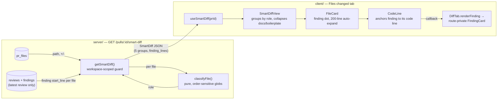

# Smart Diff

Cross-package concern (`server/` + `client/`): groups a PR's changed files by
*role* instead of GitHub's raw file order, and — once a review has run —
surfaces findings inline in the diff instead of only on the separate "Agent
runs" tab.

## What it does (user-facing)

On a PR's **Files changed** tab, a **"Smart order" / "Original order"**
toggle switches between two renderings of the same file list:

- **Smart order** (default whenever the Smart Diff data has loaded) — files
  grouped into five role sections, each labeled with the role name and a file
  count: **Core** (business logic) → **Tests** → **Wiring** (config/barrel
  files) → **Docs** → **Boilerplate** (lockfiles/generated/snapshots). All
  five groups render even when empty.
  - `docs` and `boilerplate` groups are **collapsed by default**.
  - Files in the other three groups still follow the pre-existing
    auto-expand rule: open by default if `additions + deletions <= 200`
    lines (`AUTO_EXPAND_MAX_LINES` in
    `client/src/components/diff-viewer/constants.ts`).
- **Original order** — the pre-existing flat, GitHub-order `DiffViewer`,
  unchanged.

Once a review has run, Smart order adds two more things, both scoped to the
**latest** review only:
- Each group header shows how many of its files contain at least one
  finding — a **file count**, not a total finding count (e.g. "2
  finding-lines" means 2 files in that group have findings, however many
  findings each has).
- Each file card gets a small severity-colored dot if it has any findings
  (colored by the *worst* severity present).
- Expanding a file renders each finding inline, directly beneath the code
  line it's anchored to — severity, title, rationale, Accept/Dismiss — the
  same finding-card UI previously only reachable via the "Agent runs" tab.

## Classification: the 5 roles

Source of truth: `server/src/modules/reviews/smart-diff/classify.ts`
(`classifyFile(path): SmartDiffRole`, pure — no DB/HTTP) and its glob
pattern lists in `server/src/modules/reviews/smart-diff/constants.ts`.

`classifyFile` checks roles in a **fixed order — first match wins**:

```
boilerplate → tests → wiring → docs → (core, implicit fallback)
```

`core` has no pattern list — any path that matches nothing above is `core`.
A pattern with no `/` matches the file's **basename** anywhere in the tree
(e.g. `*.lock` also matches `server/pnpm-lock.yaml`); a pattern containing
`/` matches the **full relative path**, where a leading `**/` segment also
matches zero directories (so `**/*.md` matches a root-level `README.md`
too, not just a nested one).

Order matters because the pattern lists deliberately overlap. Three pinned
edge cases (see `server/test/smart-diff-classify.test.ts`):

| Path | Role | Why |
|---|---|---|
| `src/__tests__/__snapshots__/x.snap` | `boilerplate`, not `tests` | the snapshot rule (`**/__snapshots__/**`, `*.snap`) is checked before the tests rule, even though the path is inside a `__tests__` dir |
| `.claude/skills/security/SKILL.md` | `wiring`, not `docs` | `.claude/**` is a wiring pattern, checked before `**/*.md` |
| `e2e/README.md` | `tests`, not `docs` | `e2e/**` is a tests pattern, checked before `**/*.md` |

## API contract

Shared Zod contract — **vendored** in both `server/src/vendor/shared/contracts/brief.ts`
and `client/src/vendor/shared/contracts/brief.ts` (kept in sync by hand, per
this repo's shared-contract convention).

```ts
SmartDiffRole = 'core' | 'tests' | 'wiring' | 'docs' | 'boilerplate'

SmartDiffFile = {
  path: string
  pseudocode_summary?: string | null   // reserved; not populated by this feature
  additions: number
  deletions: number
  finding_lines: number[]              // start_line of each finding from the LATEST review, sorted
}

SmartDiffGroup = { role: SmartDiffRole; files: SmartDiffFile[] }

SmartDiff = {
  groups: SmartDiffGroup[]             // always 5 entries, in fixed order, even if empty
  split_suggestion: {
    too_big: boolean                   // not computed by this feature — always false today
    total_lines: number
    proposed_splits: { name: string; files: string[] }[]  // always []
  }
}
```

`GET /pulls/:id/smart-diff` (`server/src/modules/reviews/routes.ts`, handler
in `server/src/modules/reviews/smart-diff/service.ts`, `getSmartDiff`):

- Workspace-scoped: guards on `reviewRepo.getPull(workspaceId, prId)` first
  (404 if not found/not in this workspace) — `getPrFiles` itself isn't
  workspace-scoped, so the guard exists specifically to stop a caller
  reading another workspace's PR files by guessing a `prId`.
- Computed on the fly from `pr_files` + `reviews`/`findings` — **nothing is
  persisted**.
- `finding_lines` comes only from the **latest** review for the PR (reviews
  come back newest-first; an older, superseded review's findings never
  appear). No reviews yet → every file's `finding_lines` is `[]`.
- All 5 groups are always present in the response, in the fixed
  `core, tests, wiring, docs, boilerplate` order, even when a group has no
  files.
- `split_suggestion` is currently a stub (`too_big: false`, empty
  `proposed_splits`) — `total_lines` is real (sum of every changed file's
  `additions + deletions`), the split logic itself isn't implemented yet.

Client: `useSmartDiff(prId)` in `client/src/lib/hooks/reviews.ts` — a plain
TanStack Query `GET` against that endpoint, keyed `["smart-diff", prId]`.

## Data flow



## `diff-viewer` injection pattern

`client/src/components/diff-viewer` is a shared component used by both the
flat and the Smart-order rendering. It renders the generic finding chrome
(the severity-colored bar + severity label, in `CodeLine`) but never imports
the route-private `FindingCard` itself. Instead, the route
(`DiffTab.tsx`) passes a `renderFinding: (finding) => ReactNode` callback on
`DiffFindingsApi` (`client/src/components/diff-viewer/comments.ts`);
`CodeLine` calls `findingsApi.renderFinding(f)` to render the actual card
under the severity bar it owns.

This keeps `diff-viewer` reusable/decoupled from any one route's finding-card
implementation — a deliberate pattern worth following for any future feature
that extends `diff-viewer` with route-specific rendering, rather than having
the shared component import route-private components directly.

## Forward-looking note

`classifyFile` is intentionally pure and framework/DB-independent so it's
importable standalone. It is expected to be reused later as a pre-prompt
filter (e.g. to deprioritize boilerplate/docs files before they reach the
LLM) — that reuse is not implemented anywhere yet.
