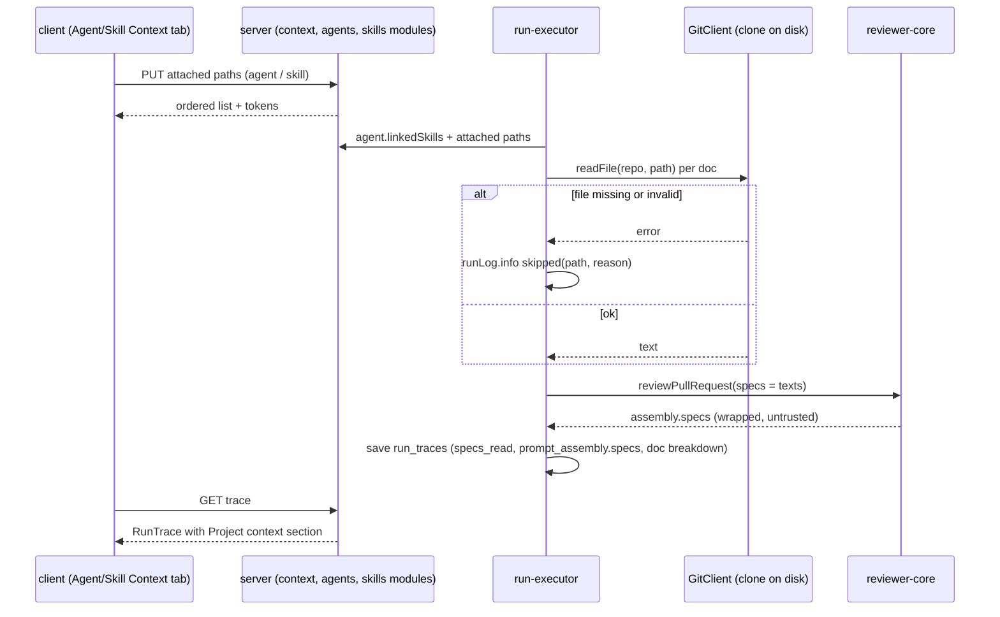

# Spec: Project Context (design node N6)  |  Spec ID: SPEC-01  |  Status: ready for planning
Supersedes: none

## Проблема й навіщо
Reviewer agents only see the diff plus repo-intel enrichment; the team's own specs, architecture notes and incident write-ups (Markdown in the repo) never reach the prompt, so reviews ignore house rules. The prompt already has an unused `specs` slot (`reviewer-core/src/prompt.ts` renders `## Project context`; `run-executor.ts` always sends `specs_read: []` and no `specs`), and the client already has a "Project Context" nav entry, `context.json` i18n strings and `useContextFiles` calling a `/repos/:id/context` route that does not exist on the server. This spec fills that gap in the simplest way: list repo `.md` docs, let users attach them to agents and skills, count tokens, inject the text as an untrusted block, and show exactly what was sent in the run trace.

## Goals / Non-goals
- Goals:
  - A "Project Context" page listing all Markdown documents found in the active repo's on-disk clone, each with a dynamically computed token count and a "Used by N agents" number, with a read-only Preview.
  - A Context tab in the Agent editor and in the Skill editor to attach/detach/reorder docs; the tab shows per-doc tokens and a total.
  - A skill's attached docs are inherited by every agent that links that skill.
  - At review time, attached docs are read from the repo on disk and injected as an untrusted `## Project context` block.
  - Run trace: an explicit "Project context — attached specs (untrusted)" section in Prompt assembly, openable to read the exact injected text.
  - A missing/unreadable attached doc is skipped and logged; the run never fails because of it.
- Non-goals:
  - Editing docs (Edit toggle, Save, write-back). Decision: VIEW-ONLY. See Design analysis.
  - Coverage score (the "78" ring), indexing, chunks, embeddings, re-index button, "1,240 chunks" footer. Cut; these numbers in the mockups are mock data.
  - Versioning of docs or of attachments (no history table, no pinning to a commit).
  - Semantic/partial retrieval: whole docs are injected, not chunks.
  - Non-Markdown files, multi-repo attachment resolution, e2e flow tests (follow-up).

## User stories
- As a reviewer-workspace user, I want to browse every `.md` doc in my repo on one page, so that I can find what could ground a review.
- As an agent author, I want to attach and order docs on an agent's Context tab and see the token cost, so that I control what enters the prompt and its size.
- As a skill author, I want to attach docs to a skill, so that every agent using that skill inherits them.
- As a PR reviewer/debugger, I want to open the run trace and read the full project-context text that was sent, so that I can explain a finding or a miss.
- As a security-minded maintainer, I want docs framed as untrusted reference data, so that a poisoned doc cannot steer the reviewer.

## Acceptance criteria (EARS)
Discovery and preview
- AC-1: WHEN the client requests the context list for a repo, the system shall return every `.md` file in that repo's on-disk clone (excluding `.git/`, `node_modules/` and `.devdigest/cache/`, listed in a constant; `.devdigest/specs/` is an ordinary folder, not special), each with `path`, `size`, `tokens`, a `group` (top-level folder name, `other` for root-level files), and `used_by_agents`. The list shall be capped at 500 files. The response envelope is `{ files, truncated }`; each file may carry an optional `reason` (`too_large` | `empty` | `unreadable`).
- AC-2: The system shall compute `tokens` from the file's current content on every list/preview request using the existing `container.tokenizer.count` (tiktoken); the value shall not be persisted.
- AC-3: WHEN the user clicks Preview on a doc, the system shall return that file's text and the client shall render it read-only as Markdown, showing its token count, an "Attached" badge if attached to any agent/skill, and "Used by N agents".
- AC-4: The Project Context page and previews shall expose no edit control and no write endpoint shall exist for docs.
- AC-5: IF a requested path (preview or attach) is not a `.md` file, is absolute, contains `..`, is a duplicate within the list, or resolves (after realpath) outside the repo clone root, THEN the system shall reject it with a 422 and not read it. An attached path is NOT required to exist (AC-13), and an attachment list is capped at 50 paths.
- AC-6: IF the repo has no clone on disk (`clone_path` null or directory missing), THEN the list endpoint shall return `{ files: [], truncated: false }` with a top-level `reason: 'no_clone'` the UI shows as an empty state, not a 5xx.

Attachment
- AC-7: WHEN the user changes attachments on the Agent editor Context tab (`PUT /agents/:id/context` with `{ paths: string[] }`), the system shall persist the full ordered list of repo-relative doc paths for that agent and return the ordered paths.
- AC-8: WHEN the user changes attachments on the Skill editor Context tab (`PUT /skills/:id/context` with `{ paths: string[] }`), the system shall persist the full ordered list of doc paths for that skill and return the ordered paths.
- AC-9: The Context tab shall show "K of N attached" (N = docs found in the active repo), drag-reorder, per-row checkbox, group badge, Preview button, and a total "≈ T tokens" equal to the sum of attached docs' tokens (deduplicated, including docs inherited from linked skills, labeled as inherited and not removable there). Per-doc tokens come from the list endpoint. The inherited/effective list is computed on the client (agent's own paths, then linked skills' paths, deduplicated). WHEN no repo is active, the tab shall show an empty state ("Select a repo to attach context") with controls disabled.
- AC-10: WHERE an agent links skills, the effective doc list for a run shall be the agent's own docs in order, followed by each linked and enabled skill's docs in the skill link order, de-duplicated by path (first occurrence wins).
- AC-11: The system shall compute `used_by_agents` for a doc as the count of distinct agents in the workspace (enabled or not) whose effective doc list contains it (directly or via an enabled linked skill), and for a skill as the count of agents linking it. No coverage score shall be computed or shown.
- AC-12: WHEN an agent or skill is deleted, the system shall remove its attachment rows (cascade).
- AC-13: IF an attached path is not present in the active repo's list, THEN the Context tab shall still show it, marked "not found in this repo", and keep it attached until the user removes it.

Run-time injection
- AC-14: WHEN a review run starts for an agent with a non-empty effective doc list, the system shall read each doc from the PR repo's on-disk clone (the synced default-branch clone — `sync` resets it to `origin/<default>` — not the PR head; the run path must sync before reading, verified during implementation) and pass the texts to `reviewPullRequest` as `specs`.
- AC-15: The system shall assemble the block as `## Project context`, a one-line notice that the docs are untrusted reference material, then one entry per doc headed `### <path>`, each entry delimiter-wrapped with `wrapUntrusted`; the injection guard text shall name attached project docs as data, never instructions. The `specs` input keeps its `string[]` shape: the server pre-formats each entry as `### <sanitised path>` followed by the content, and reviewer-core wraps each entry with `wrapUntrusted` using its fixed `spec-${i}` label and adds the notice line.
- AC-16: IF an attached doc cannot be read (deleted, moved, unreadable, fails path validation), THEN the system shall skip it, emit a run-log event naming the path and reason, and continue the run.
- AC-16a: IF an attached doc exceeds 200 KB, THEN the system shall skip it with reason `too_large`; IF the running total of injected docs would exceed 30,000 tokens, THEN the system shall skip that doc and all later ones with reason `budget_exceeded`. Docs are never truncated.
- AC-16b: The project-context injection shall apply only to studio review runs; the GitHub/CI `agent-runner` path is unchanged apart from the shared `INJECTION_GUARD` wording (accepted), and `reviewPullRequest` stays backward compatible when `specs` is absent.
- AC-17: IF all attached docs are skipped or none are attached, THEN the prompt shall omit the `## Project context` section entirely (existing omit-when-empty contract; no placeholder text).
- AC-18: WHEN docs are injected, the system shall record in the run trace `specs_read` (paths actually injected), `prompt_assembly.specs` (the exact injected text), and a per-doc breakdown (`project_context_detail`) of `path`, `tokens` and status (`injected` or `skipped` with reason) so skipped docs remain visible after the fact.
- AC-19: The system shall not add attachment or doc-content versioning; the trace's stored text is the only historical record.

Trace UI
- AC-20: WHERE `prompt_assembly.specs` is present, the Run trace drawer's Prompt assembly shall show a section titled "Project context — attached specs (untrusted)" with the total token count (sum of `project_context_detail[].tokens` for injected docs), expandable inline, with Copy and a full-screen modal containing in-block search and Copy (reuse `PromptBlock`/`PromptModalBody`).
- AC-21: WHERE a doc was skipped, the section shall list it as skipped with its reason.
- AC-22: WHEN a trace persisted before this feature (specs null, `specs_read` empty) is opened, the section shall be absent and the drawer shall render without error.

State (attachment resolution at run start)

## Edge cases
- Attached doc deleted or renamed after attach — skipped and logged at run time; still shown as "not found" in the tab (AC-13, AC-16).
- Same doc attached directly and via two skills — injected once (AC-10).
- Agent attached to doc from repo A runs on repo B — path-only attachment resolves against repo B; a missing path is skipped and logged. Behavior is intentional (see Decisions 1).
- Doc contains the literal `</untrusted>` — `wrapUntrusted` already neutralises it; must be covered by a test.
- Very large doc, or many docs — over-limit docs are skipped with reason `too_large` / `budget_exceeded` rather than truncated silently (AC-16a).
- Empty or binary-looking `.md` file — empty file skipped with reason `empty`; invalid UTF-8 read as replacement chars, not a failure.
- Symlink inside the repo pointing outside the clone — rejected by realpath check (AC-5).
- Clone missing/not yet synced — list empty with reason; run logs "no clone, project context skipped" (AC-6, AC-16).
- Disabled skill that has docs — its docs are not injected, matching the existing rule that a link alone is not enough (`run-executor.ts` filters `skill.enabled`).
- Agent has repo-intel off — project context is independent and still injected.
- Two concurrent edits of the attachment list — last write wins (full-list replace).

## Design analysis
- Missing elements:
  - No `/repos/:id/context` route, service, table, or attachment storage exists on the server. Only the contract `SpecFile` (`path`, `content?`, `size?`, `updated_at?`) and `IndexStatus` exist in `platform.ts`, and client hooks `useContextFiles` and `useReindexContext` (`client/src/lib/hooks/core.ts`). `SpecFile` needs `tokens`, `group`, `used_by_agents` (both vendored copies). `IndexStatus`/`useReindexContext` and the chunk/reindex/edit strings in `context.json` become dead and shall be removed.
  - `GitClient` (`vendor/shared/adapters.ts`) has only `readFile`; no directory listing. A list-markdown capability (e.g. `git ls-files '*.md'` or a fs walk) must be added to the port, `SimpleGitClient`, and `adapters/mocks.ts`. Existing `SimpleGitClient.readFile` does `join(clonePath, path)` with no traversal guard, so AC-5 must be enforced in the new code path.
  - `RunTrace` has no place for skipped docs or per-doc tokens; an optional `project_context_detail` array (nullish, like `skills_detail`) is needed in both vendored `trace.ts` copies.
  - `RunLogger` kinds are `info | tool | result | error` (no `warn`); skipped-doc events use `info` (or `error`-free wording) unless a level is added.
  - Existing `PromptAssembly.specs` is one string, so per-doc paths in the trace come from the new detail array, not from parsing the block.
- Uncovered edge cases: pagination/large repos (hundreds of `.md` files; list must cap and say so); token counting cost on every list call (tiktoken over all files; tokenize live with no cache; add an mtime-keyed, non-persisted cache only if measurement shows a problem); non-UTF8 filenames; CRLF; front-matter; case-only path differences on macOS.
- Cross-module interactions:
  - server: new `modules/context` (routes, service; repository for attachments), migration for two join tables (`agent_context_docs`, `skill_context_docs`: owner id, path, order, PK owner+path, FK cascade), container wiring, `agents`/`skills` services, `run-executor.ts` (resolve effective list, read, skip+log, pass `specs`, write trace), `platform/trace-builder.ts`, `adapters/git` + `mocks.ts`. Migrations are not auto-applied (`pnpm db:migrate`).
  - reviewer-core: `assemblePrompt` heading/notice text and `INJECTION_GUARD` wording; keep the `specs?: string[]` public shape so the CI runner path is unaffected. Must stay pure (no fs).
  - client: new route `src/app/repos/[repoId]/context/page.tsx` (thin) with colocated `_components`; Context tab in `AgentEditor` and `SkillEditor` (both use a `TABS` constant + `?tab=`); hooks in `src/lib/hooks/*`; `TraceBody.tsx` label/section change; i18n keys in `messages/en/context.json` and `runs.json` (existing `trace.prompt.specs` = "Project context (dynamic)"). Sidebar key `context` already exists in `activeKeyFor`.
  - Vendored `@devdigest/shared`: every contract change (`SpecFile`, attachment bodies, `RunTrace`) must be hand-edited in `server/src/vendor/shared` and `client/src/vendor/shared`. The copies already drift (e.g. `trace.ts` line numbers differ), so diff them first.
  - Editing evaluation: the clone is a read-only mirror; `SimpleGitClient.sync` does `reset --hard origin/<branch>`, so any local edit would be silently wiped on next resync and would never reach GitHub. A write-back path would need a commit/PR flow, conflict handling and auth. That is clearly not cheap; recommendation and decision: view-only.
  - Trust: docs are read from the synced default-branch clone, so a PR cannot inject content through its own changed docs into its own review (worth stating in the UI/docs).
- UX improvements (out of scope): show docs that changed in the PR; "attach to all agents" bulk action; warn when total tokens exceed a share of the model context; deep-link from a trace's skipped doc to the Context tab; searchable doc list.

## Non-functional
- Performance: list + tokenization for a typical repo (up to ~200 docs) should feel instant; bound the file walk and per-file size (constants, AC-1 and AC-16a). Target: list endpoint p95 under 1 s for a repo with up to 200 `.md` files.
- Security: path validation and realpath containment (AC-5); workspace scoping via `getContext` on every route; new routes declare `schema.params/body/response` with Zod; doc text never logged in full.
- Accessibility: drag-reorder must have a keyboard alternative (move up/down); checkboxes labeled by path; the trace modal traps focus and closes on Escape (matches existing `Modal`).
- Reliability: a doc problem never fails a run (AC-16).

## Inputs (provenance)
- Doc list, sizes, content: [deterministic: read from the repo clone on disk via `GitClient`], not from GitHub API at request time.
- Token counts: [reused: `container.tokenizer` (tiktoken)], computed on demand.
- Attached paths and order: [user-provided via Agent/Skill Context tab], stored in the new join tables.
- Effective list at run time: [deterministic: agent docs, then enabled linked skills' docs in link order, dedupe by path]; reuses `agents.linkedSkills` and the `skill.enabled` gate.
- `used_by_agents`: [deterministic: count over join tables + `agent_skills`].
- Group badge: [deterministic: top-level folder of the path; see AC-1].
- Trace text: [reused: `PromptAssembly.specs` from reviewer-core].

## Untrusted inputs
- Doc content is repo-authored text that can be attacker-influenced (any contributor, or a merged malicious doc). It is injected only inside `wrapUntrusted` delimiters under a heading that states it is untrusted, and the shared `INJECTION_GUARD` must be extended to name attached docs as data, never instructions. Docs must never be concatenated into the system prompt or executed/interpolated.
- Doc paths are also untrusted input (from the client) and are validated per AC-5; the server sanitises names inside `### <path>` headings so a crafted filename cannot forge a delimiter. reviewer-core uses fixed labels, so the `wrapUntrusted` label cannot be forged.
- The Preview renders doc Markdown in the browser: render with `react-markdown` (already a client dependency) with raw HTML disabled; never `dangerouslySetInnerHTML`.

## Decisions (former open questions, resolved)
1. Attachments are path-only (repo-relative) and resolved against the PR's repo at run time; missing = skip + log.
2. Every `.md` outside the excluded folders counts; group = top-level folder name, else `other`; `.devdigest/specs/` is not special.
3. Per-doc cap 200 KB, list cap 500 files, total injected budget 30,000 tokens; over-limit docs are skipped with a reason, never truncated.
4. "Used by N agents" counts all workspace agents, including via enabled linked skills; it is path-only (global by path), not scoped per repo.
5. Latency target: p95 under 1 s for up to 200 docs.
6. Studio-only; the CI `agent-runner` path is unchanged.
7. Skipped docs are surfaced via run log + trace detail only; no warning badge in the PR Agent runs list (possible follow-up).
