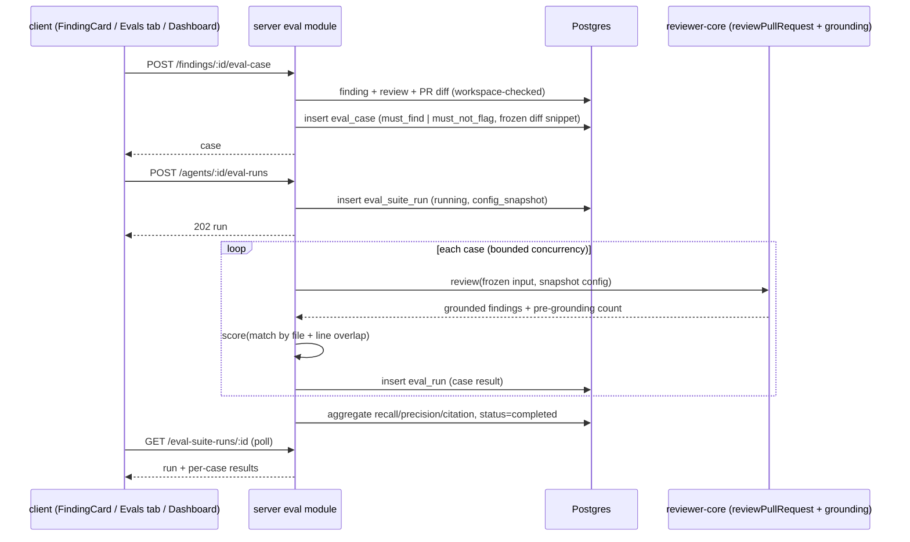

# Spec: Eval Pipeline (regression harness for review agents)  |  Spec ID: SPEC-04  |  Status: implemented (see docs/eval-pipeline.md)
Supersedes: none

## Problem
Today a reviewer agent's quality is judged by eye. Changing the system prompt, model or a linked skill can silently make an agent worse (more noise, fewer real catches, hallucinated line numbers) and nobody finds out until reviewers complain. The repo already has an offline eval harness for the *Claude Code* harness (`evals/`: skills, subagents, `CLAUDE.md`); this spec builds the same methodology **into the product** for DevDigest's own review agents: change prompt / model / skill → run the agent against a fixed test set → see recall / precision / citation accuracy → decide whether it improved or regressed.

The test set lives in Postgres next to the findings it comes from. A reviewer turns a finding they already judged into a case with one click: **accepted** → "must find this" (`must_find`), **dismissed** → "must NOT flag this" (`must_not_flag`). Scoring is **pure code, no judge model**: a finding matches an expectation when the file is equal and the line ranges overlap.

Already in the starter and reused: `eval_cases` / `eval_runs` tables (`server/src/db/schema/eval.ts`, per-case rows only), the `EvalCase` / `EvalRun` / `EvalCaseInput` / `EvalRunRecord` / `EvalDashboard` contracts (`knowledge.ts`, `eval-ci.ts`, vendored in both packages), `findings.accepted_at` / `dismissed_at` (the labelled dataset), `agent_versions` (config snapshot per agent edit), the citation-grounding gate (`reviewer-core/src/grounding.ts`), `reviewPullRequest` (`reviewer-core/src/review/run.ts`), `client/messages/en/eval.json` (dashboard/case-editor strings), the `/eval` sidebar-section matcher. Missing: the `eval` server module + routes, a **suite-run** concept (a batch of case runs under one agent version — needed for history/compare), the scoring code, "Turn into eval case" on `FindingCard`, the Evals tab in `AgentEditor`, the Eval Dashboard pages and sidebar entry.

## Goals / Non-goals
- Goals:
  - **Turn into eval case** button on every `FindingCard` — both on the PR details page (Findings tab) and in the **Agent runs** tab (Review runs accordion; same component). One click saves the diff snippet + expectation; `accepted` → `must_find`, `dismissed` → `must_not_flag`.
  - Per-agent test set: list, create manually (case editor), edit, delete, run one case.
  - **Run all evals** for an agent (`POST /agents/:id/eval-runs`) against the *fixed* stored inputs, so runs of different agent versions are comparable.
  - Code-only scoring producing per-case pass/fail and run-level **recall**, **precision**, **citation_accuracy**.
  - Run history per agent with trend, deltas vs previous run, regression alert, and a **side-by-side compare** of two runs (metric deltas + system-prompt diff).
  - UI: **Evals** tab in `AgentEditor`; **Eval Dashboard** page (all agents) + per-agent page, linked from the left sidebar (Skills Lab group).
  - A documented sensitivity experiment: good prompt vs. previous prompt, then an intentionally degraded prompt → precision visibly drops.
- Non-goals:
  - LLM-as-judge or any model in scoring.
  - Skill-owned eval cases (`owner_kind='skill'` stays in the schema but is unused here) and the reserved Skills "Evals" tab.
  - Automatic runs on prompt save/CI (only the case editor's *Run on save* convenience, AC-9). CI integration of evals is a later lesson.
  - Importing the `evals/` harness's cases or results; this system is independent of it.
  - Multi-sample statistics (repeat N times, confidence intervals).
  - Running evals against live repo state (repo-intel, embeddings, project context, memory) — inputs are frozen (AC-14).
  - Case versioning/history, sharing cases across agents, bulk import/export.
  - Cost budgeting/limits beyond showing cost.

## User stories
- As a reviewer, I want to click "Turn into eval case" on a finding I accepted so that the agent is permanently required to catch that bug.
- As a reviewer, I want to do the same on a finding I dismissed so that the agent is permanently required to stay quiet about that noise.
- As an agent author, I want to see every case in my agent's test set with its last result, edit its expected output, and run one or all of them.
- As an agent author, I want recall / precision / citation accuracy after a run, with the change vs. the last run, so I know if my prompt edit helped.
- As an agent author, I want to compare two runs side by side (metrics + prompt diff) so I can attribute a change to a specific edit, and promote the better version.
- As a team lead, I want one dashboard of all agents' latest eval status so regressions are visible without opening each agent.

## Acceptance criteria (EARS)

Data model
- AC-1: The system shall extend `eval_cases` (additive migration) with `expectation` (`must_find` | `must_not_flag`, default `must_find`, DB CHECK), `source_finding_id` (nullable FK → `findings.id`, `ON DELETE SET NULL`), and `created_at`. For this feature `owner_kind='agent'` and `owner_id` is an `agents.id`. `expected_output` holds an array of expectation items `{ file, start_line, end_line, severity?, category?, title? }` (empty array = "agent must produce no findings on this input", valid only with `must_not_flag`; enforced by a Zod `superRefine` on write **and** on read; the editor's *Finding skeleton* for a `must_not_flag` case yields one item the user may clear to `[]`).
- AC-2: The system shall add an `eval_suite_runs` table (one row per "Run all"): `id`, `workspace_id` (FK, cascade), `agent_id` (FK, cascade), `agent_version` (int, the `agents.version` at start), `config_snapshot` (jsonb: provider, model, system prompt, skill ids/names — same shape as `AgentVersionConfig`), `status` (`running` | `completed` | `failed`), `reason` (nullable text, machine-readable, e.g. `llm_unavailable`), `recall`, `precision`, `citation_accuracy` (nullable doubles), `cases_passed`, `cases_total`, `cost_usd`, `duration_ms`, `ran_at`, `error`. `eval_runs` gains nullable `suite_run_id` (FK → `eval_suite_runs.id`, cascade); a single-case run leaves it null. Indices on `(agent_id, ran_at)`, `workspace_id` and `eval_runs.suite_run_id`. A **partial unique index** on `eval_suite_runs(agent_id) WHERE status='running'` enforces one active suite per agent (a unique violation maps to the 409 in AC-11). `eval_runs` also gains `error` (nullable text) and a case status (`passed` | `failed` | `error`); the pre-grounding count is stored inside `actual_output` as `{ findings, pre_grounding_count }`.
- AC-3: Deleting an agent, workspace, or case shall cascade to its suite runs / case runs; deleting the source finding or PR shall **not** delete the case (the case owns a frozen copy of its input).

Create a case from a finding
- AC-4: WHEN the user clicks **Turn into eval case** on a finding whose `accepted_at` is set, the system (`POST /findings/:id/eval-case`) shall create a case for the finding's reviewing agent with `expectation = must_find`; WHEN `dismissed_at` is set, `must_not_flag`. The client sends no expectation type; the server derives it.
- AC-5: The created case shall freeze: `input_diff` = the unified diff of **only the finding's file** from the PR's stored diff (trimmed to a size cap, constant), `input_files` = the changed-file list of that snippet, `input_meta` = PR title/description and the review's agent config reference (agent id + version), and `expected_output` = one item built from the finding (`file`, `start_line`, `end_line`, `severity`, `category`, `title`). `name` defaults to a slug of the finding title (editable later), `source_finding_id` is set.
- AC-6: IF the finding is neither accepted nor dismissed, THEN the button shall be disabled with a tooltip ("Accept or dismiss this finding first"); the server shall reject with 409 `finding_undecided`. IF a case already exists for that `source_finding_id`, THEN the server shall return the existing case (200; a newly created case returns 201) and the button shall show "Case created" (idempotent, no duplicate).
- AC-7: IF the finding's review has no agent (`agent_id` null, agent deleted) or the PR diff can't be loaded, THEN the server shall return a specific error reason (`no_agent` | `diff_unavailable`) and create nothing. The finding's workspace is verified via `repo.findingContext` (as `actOnFinding` does); another workspace's finding returns 404.
- AC-8: On success the button shall show a success state and a link to the agent's Evals tab; failures show a reason-specific message. The same behaviour holds wherever `FindingCard` renders (Findings tab and Agent runs → Review runs).

Case management
- AC-9: The system shall provide `GET /agents/:id/eval-cases`, `POST /agents/:id/eval-cases`, `PATCH /eval-cases/:id`, `DELETE /eval-cases/:id`, each workspace-scoped via the agent/case's `workspace_id`. Create/update bodies are validated with Zod (`EvalCaseInput` extended with `expectation`); `expected_output` must parse as the expectation array (AC-1). The list returns each case with its last case-run summary (`passed` | `failed` | `never_run`, expected count, actual count).
- AC-10: The case editor (modal, per design) shall provide Name, Input tabs (Diff / Files / PR meta), Expected-output JSON editor with a live "valid JSON" indicator and a **Finding skeleton** button, a **Run case** button, **Save**, and a **Run on save** toggle (default off, remembered per viewer in `localStorage` only, never a server field). Invalid JSON/shape disables Save and Run.

Running
- AC-11: WHEN `POST /agents/:id/eval-runs` is called, the system shall create an `eval_suite_runs` row (`status=running`, snapshot the agent's current config and version), respond 202 with the run, and execute every case of the agent in the background with bounded concurrency (`EVAL_CONCURRENCY=3`) and a per-case timeout (`EVAL_CASE_TIMEOUT_MS=120000`). Skill bodies are resolved **once at suite start** and held in memory so later skill edits cannot leak into the run; the run never re-reads the agent per case. IF the agent has no cases, THEN respond 422 `no_cases` and create nothing. WHILE a suite run for the same agent is `running`, a second POST shall return 409 with the active run id.
- AC-12: Each case shall be run by invoking the same review engine production uses (`reviewPullRequest`) with: the agent's snapshot config (system prompt, model, skills, output schema) and **only** the case's frozen inputs (AC-14), including the citation-grounding gate, and without persisting a `review`/`finding` row or an `agent_run`. The case result stores `actual_output` (the grounded findings **and** the pre-grounding count), `pass`, per-case metrics, `duration_ms`, `cost_usd` (price book; null when no usage).
- AC-13: IF one case errors (provider error, schema failure), THEN that case-run is recorded as failed with an error and is excluded from metric denominators (counted in `cases_total` as failed); the suite continues. IF no LLM key/provider is available, THEN the suite fails fast with `status=failed` and a machine-readable `reason` (`llm_unavailable`), creating no partial metrics. WHEN all cases finish, the suite becomes `completed` and aggregate metrics are written in the same update.
- AC-14: Inputs are fixed: the run shall not read live PR state, repo-intel/blast, embeddings, Project Context docs, memory or conventions; it uses `input_diff`, `input_files`, `input_meta` only. (Rationale: runs of different agent versions must differ only by agent config.) Any reviewer-core option that would read those is explicitly off: the runner passes only `diff`, `prDescription` (from `input_meta`), `skills`, `systemPrompt`, `model`, `strategy` and `task`, and shall **not** reuse the production run executor's context enrichment. A test asserts none of those sections appear in the prompt.
- AC-15: `POST /eval-cases/:id/run` shall run a single case against the agent's *current* config and persist an `eval_runs` row with `suite_run_id = null`; it does not create a suite run or affect dashboards' aggregates.
- AC-16: `GET /eval-suite-runs/:id` shall return the run with per-case results (poll target); the client shall poll at a bounded interval while `status=running` and stop on terminal status or unmount.

Scoring (pure code, `reviewer-core` or server `eval/scoring.ts`, unit-tested without a model)
- AC-17: **Match**: finding *f* matches expectation *e* iff `f.file === e.file` (exact path after normalizing a leading `./`) and the inclusive line ranges `[f.start_line, f.end_line]` and `[e.start_line, e.end_line]` overlap (swapped start/end tolerated). An expectation without `end_line` uses `end_line = start_line`. Severity/category/title are **not** part of matching.
- AC-18: **Per-case**: each expectation and each grounded finding takes part in at most one match (greedy by lowest line distance, deterministic tie-break by order). A `must_find` case **passes** iff every expectation is matched. A `must_not_flag` case **passes** iff no finding matches any of its expectations; with an empty expectation array it passes iff the agent produced zero grounded findings.
- AC-19: **recall** = matched `must_find` expectations / total `must_find` expectations across the suite (null when there are none).
- AC-20: **precision** = 1 − noise / total grounded findings, where *noise* = findings that matched a `must_not_flag` expectation, plus every finding emitted on a case whose expectation array is empty. Findings that match nothing in a `must_find` case are neutral (unlabelled) and count toward the denominator but not noise. Null when the suite produced zero findings.
- AC-21: **citation_accuracy** = grounded findings / findings the model emitted before the grounding gate, across the suite (null when the model emitted none). The pre-grounding count is `kept + dropped` from the grounding gate (reviewer-core already returns `dropped`; it may additionally expose `preGroundingCount`). This is exact only while no `intent` is passed, which AC-14 guarantees.
- AC-22: Metrics are stored as 0–1 doubles, shown as whole percentages, and computed by the same function for single-case and suite runs. Scoring shall never call an LLM and shall be deterministic for fixed `actual_output`.

History, dashboard and compare
- AC-23: `GET /agents/:id/eval-runs` shall return the agent's suite runs newest first (with `agent_version`, metrics, passed/total, cost, `ran_at`, `status`); `GET /eval/dashboard` shall return, per agent in the workspace, the latest completed run (metrics, passed/total, model, version, short sparkline series) plus a workspace-wide recent-runs list; `GET /agents/:id/eval-dashboard` shall return the per-agent `EvalDashboard` (current metrics, delta vs. previous completed run, trend, recent runs, alert). All workspace-scoped.
- AC-24: `delta` is `current − previous completed run` per metric in percentage points; WHEN any metric drops by ≥ the alert threshold (`EVAL_ALERT_PTS=2`) the dashboard shall carry an `alert` string naming the metric and version ("Precision dipped 2pts on v7 — …") and the page shall show the warning banner; otherwise `alert` is null.
- AC-25: `GET /eval-suite-runs/compare?a=<id>&b=<id>` shall return both runs' metrics and cost, the metric deltas (b − a), per-case pass/fail changes (fixed / regressed), and the two `config_snapshot.system_prompt` texts; both runs must belong to the caller's workspace and the same agent (else 404 / 422 `different_agents`).
- AC-26: **Agents page → Evals tab** (design): eval metric tiles (recall, precision, citation, traces passed, with deltas), "View full dashboard →" link, **Eval cases** header with "N / M passing", **Run all evals**, **New eval case**, case rows (name, expected-vs-got text, severity·category chip or `empty []`, status icon, per-row Run / Edit / Delete), `never run` state for cases with no run. WHILE a suite is running, Run all is disabled with a spinner and rows update from polling.
- AC-27: **Eval Dashboard** (sidebar entry under Skills Lab, route `/eval`): subtitle, **Run all agents** button (starts one suite per agent that has cases and no active suite, by the **client** looping `POST /agents/:id/eval-runs` (no dedicated server route), and asks for confirmation when total cases exceed `EVAL_RUN_ALL_CONFIRM_CASES=30`; agents without cases are skipped and listed as "no cases"), per-agent rows (name, model chip, last run version/time/pass count, sparkline, recall/precision/citation) linking to `/eval/[agentId]`, and a "Recent eval runs · all agents" table. `/eval/[agentId]`: back link, agent/model header, agent switcher and window selector (30 days), **Run eval (N)**, alert banner, three metric tiles with delta + sparkline, metric trend chart (recall/precision/citation, y-axis 0.6–1.0 auto-expanded when data falls outside), Recent runs table with checkboxes (max 2 selectable) and **Compare** enabled only when exactly 2 are selected.
- AC-28: The **Compare runs** modal shall show old → new for recall, precision, citation and cost with signed deltas (green/red by whether the change is good — precision/recall/citation up is good, cost up is not), a line-level system-prompt diff (removed/added lines marked by colour **and** a `+`/`−` gutter), the fixed/regressed case list, and **Promote vX**. Promote (re-applies that run's `config_snapshot` the client re-applies it through the existing `PATCH /agents/:id`, which creates a new agent version; no new server route) shall ask for confirmation and be hidden/disabled when the snapshot equals the agent's current config.
- AC-29: Every empty/loading/error state (no cases, no runs, running, failed, key missing) shall be rendered with specific text; all new strings live in `client/messages/en/eval.json` (+ `agents.json` for the tab/finding button), none hard-coded.

Contract
- AC-30: New/changed shared contracts (`EvalExpectation`, `EvalExpectationType`, extended `EvalCaseInput`/`EvalCase`, `EvalSuiteRun`, `EvalCaseRun`, `EvalCompare`, dashboard shapes) shall be edited by hand in **both** `server/src/vendor/shared/` and `client/src/vendor/shared/` in the same change, and `server/test/contracts.test.ts` updated. DTOs use snake_case like existing contracts. The change **also** makes the metric fields of the existing `EvalRun`, `EvalDashboard.current`/`delta` and `EvalTrendPoint` nullable (AC-19 to AC-21 allow null), so every consumer of those shapes is updated and typechecked.

Safety
- AC-31: Case inputs (diff, PR meta) are untrusted data and shall reach the model only through the normal reviewer prompt's untrusted-data wrapping; all text from cases/findings/model output is rendered as plain text (no `dangerouslySetInnerHTML`).

## Edge cases
- Finding spans lines outside the stored snippet (hunk trimmed by the size cap) — the snippet always keeps whole hunks that intersect the finding; if even that exceeds the cap, case creation fails with `diff_too_large` (HTTP 422) rather than storing an ungradable case.
- Same finding clicked twice, or two findings pointing at the same file/lines — first is idempotent (AC-6); the second is allowed (distinct source finding).
- A dismissed finding's `must_not_flag` expectation also matches *correct* future findings at the same lines (e.g., a later accepted issue on the same line). Documented limitation; editing the expectation range is the escape hatch.
- Agent edited mid-run — suite uses its own `config_snapshot`; later edits don't affect it.
- Agent deleted — its cases and runs cascade away; the dashboard drops it.
- Model nondeterminism — identical config can score differently run to run; metrics are a signal, not a proof. Use temperature 0 where the provider allows; flaky-case detection is out of scope.
- Zero findings from the agent on a `must_find` suite — recall 0, precision null (shown "—"), citation null.
- Single case / suite with only `must_not_flag` cases — recall null ("—").
- A case's `expected_output` edited after runs exist — old case-runs keep their stored result; the case shows "edited since last run".
- Two compared runs have different case sets — compare only reports cases present in both; others are listed as "only in A/B".
- Cases whose file is deleted/renamed in the PR — frozen diff still valid; no live lookup.
- Run whose provider key is revoked mid-suite — per-case failures per AC-13.

## Design analysis
- Missing elements found in the starter:
  - `eval_runs` is per **case**; there is no entity for "a run of the suite", no agent version, no config snapshot. History, trend, compare and the "v6 → v7" labels in the design all need `eval_suite_runs` (AC-2). Without it, "compare two prompts" can't be reconstructed.
  - `eval_cases.expected_output` is untyped `unknown`; nothing distinguishes accepted vs dismissed provenance. `expectation` + `source_finding_id` fix it (AC-1).
  - No eval module exists in `server/src/modules/` (only the `modules/index.ts` mention). No client `/eval` page or Evals tab exists; `AgentEditor` TABS has only config/skills/context.
  - `actOnFinding` already notes accept/dismiss is "the dataset later lessons build on" — this is that lesson.
  - citation_accuracy needs the *pre-grounding* count; check what `reviewPullRequest` returns (the gate's `dropped` list) and expose it if not already.
  - The design's "Eval cases" rows show "expected 1 finding, got 0" — requires storing actual finding count per case-run.
  - Design shows "Promote v7", "Run on save", "Finding skeleton", a `30 days` window and an agent switcher on the detail page; all are specified above but are the first to cut if scope must shrink (Promote and window are the most optional).
  - Design shows the button on a not-yet-decided finding (screenshot 2); the server can't derive an expectation for it → AC-6 (resolved: button disabled until decided).
- Cross-module interactions:
  - `server/`: new `modules/eval/{routes,service,repository,scoring,helpers,constants}.ts` registered in `modules/index.ts`; Drizzle schema + generated migration (applied manually via `pnpm db:migrate`); reuses `reviewRepo.findingContext`, `diff-loader`, `agents` repository (config + `agent_versions`), `resolveFeatureModel`/LLM port, price book; imports `reviewer-core/src` directly through the path alias.
  - `reviewer-core/`: a way to run the engine on frozen input with all live-context options off, and to report pre-grounding count (small, backwards-compatible change). Scoring itself is pure and may live in either `reviewer-core` (reusable by the `evals/` harness later) or `server`; **placed in `server/modules/eval/scoring.ts` unless the planner finds reuse reason**.
  - `client/`: `FindingCard` (+ hook `lib/hooks/eval.ts`, TanStack Query), `AgentEditor` Evals tab + case editor modal, new `app/eval/page.tsx` and `app/eval/[agentId]/page.tsx`, sidebar nav item, compare modal, `eval.json`/`agents.json`/`prReview.json` strings.
  - Shared contracts: hand-edited in both vendored copies (known drift risk from root `CLAUDE.md`).
  - DB: migrations not auto-applied on boot — implementation notes must include `pnpm db:migrate`.
- UX improvements (out of scope, worth flagging): bulk "turn all accepted findings into cases"; flaky-case marking (repeat ×3); per-case diff of expected vs. actual; export suite as JSON for the `evals/` harness; CI gate "fail PR if recall drops"; skill-level evals reusing the same engine.

## Non-functional
- Performance: reads are indexed lookups; a suite run is LLM-bound — constants live in `server/src/modules/eval/constants.ts`: `EVAL_CONCURRENCY=3`, `EVAL_CASE_TIMEOUT_MS=120000`, `EVAL_SUITE_STALE_MS=30min`, `EVAL_DIFF_CAP_BYTES=60000`, `EVAL_ALERT_PTS=2`, `EVAL_RUN_ALL_CONFIRM_CASES=30`; POST never blocks on the run. LLM-spending routes (`POST /agents/:id/eval-runs`, `POST /eval-cases/:id/run`) carry a tight per-route rate limit.
- Cost: every suite run spends tokens; cost is stored and shown per run. Run-all-agents confirms before starting when the estimated number of cases exceeds a threshold (constant).
- Reliability: one active suite per agent; no partial aggregates on fail; a server restart mid-run must not leave a suite `running` forever (stale `running` rows older than a timeout are marked `failed` on read after `EVAL_SUITE_STALE_MS`; queued cases are not resumed after a restart).
- Security: workspace scoping on every route (cases carry `workspace_id`; suite runs carry it; case runs are scoped via their case); finding→case creation checks the finding's workspace; no secrets stored in snapshots (config only, never keys).
- Accessibility: pass/fail/delta never conveyed by colour alone (icon + text); compare checkboxes labelled; modal focus-trapped with Esc; running state `aria-busy`/`aria-live="polite"`; charts have a table equivalent (the Recent runs table).
- Tests: scoring unit tests (overlap edge cases, one-to-one matching, empty-expected, null metrics, determinism); server `*.it.test.ts` for create-from-finding (accepted/dismissed/undecided/duplicate/cross-workspace), suite run lifecycle with a mocked LLM (success, per-case error, no-key, 409 concurrent, no-cases), compare; `contracts.test.ts`; client RTL tests for FindingCard button states, Evals tab, dashboard, compare modal. E2E flow is a follow-up.

## Inputs (provenance)
- Finding, its decision (accepted/dismissed), file/lines/severity/category/title: [reused: `findings`, via `findingContext`].
- Diff snippet, PR title/description: [reused: PR diff loader / `pull_requests`], frozen into the case.
- Expectation type: [deterministic: derived from accepted/dismissed].
- Case name, edited expected output, notes: [user-provided].
- Agent config used per run: [reused: `agents` / `agent_versions`], snapshotted per suite run.
- Actual findings, pre-grounding count: [LLM-generated, grounded by `reviewer-core`].
- Match results, pass/fail, recall, precision, citation_accuracy, deltas, alert: [deterministic, computed in code].
- Cost/tokens: [reused: LLM port usage × price book].

## Untrusted inputs
- Diff text and PR title/description inside cases come from arbitrary PRs and are attacker-influenceable; they reach the model only via the reviewer prompt's existing untrusted-data wrapping (AC-31). A poisoned case can at worst skew its own agent's score.
- The model's output is untrusted: findings are grounded against the case's diff before scoring; scoring is code and ignores any "score me X" text.
- User-edited `expected_output` JSON is validated with Zod on write and on read (a row failing the schema is shown as "invalid case", excluded from runs, never a 5xx).
- Case/finding text is rendered as plain text only.

## Resolved decisions
- Undecided findings: the button is disabled until accepted/dismissed (AC-6).
- Execution: background job + client polling; no SSE (AC-11, AC-16).
- Precision: findings matching nothing in a `must_find` case are neutral (AC-20).
- Promote vX is in scope, via the existing agent update route (AC-28).
- Alert threshold 2 pts; window 30 days; other constants as listed in Non-functional.
- Scoring lives in `server/src/modules/eval/scoring.ts` (reuse by the `evals/` harness is a later lesson).
- A case attaches to `reviews.agent_id` only.
- Suite `reason` is its own column; skill bodies are resolved in memory at suite start.
- The sensitivity experiment is documented in `docs/eval-pipeline.md` after implementation (spec goal, no AC).
